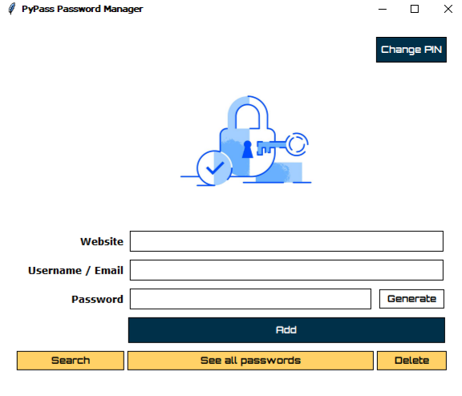

# PyPass 🔐  
A simple, secure Python password manager built with **Tkinter**.

PyPass uses custom dialogs for a clean, consistent interface and guides users with clear error messages. Passwords are encrypted with the `cryptography` library and securely stored using `pickle`. It also features automatic logout for added security.

---

## ✨ Features

### 1. 🔑 Master PIN for Security
- **First-Time Setup**:  
  On first launch, you must set a **4-digit PIN**. If the PIN isn't exactly 4 digits, the app alerts you and asks again. You'll be prompted to confirm the PIN to ensure accuracy.
- **Change PIN**:  
  Use the **Change PIN** button on the homepage to update your master PIN anytime.
- **Auto Logout**:  
  After **5 minutes of inactivity**, the app logs out automatically for enhanced security.

---

### 2. 📁 Manage Passwords Easily
- **Add**  
  Save passwords by entering the **Website**, **Username/Email**, and **Password**.  
  - If the website already exists, choose to update or add a new entry.
  - Passwords are **encrypted** before saving, so they cannot be read directly from the file.
  
- **Generate**  
  Generate strong, random passwords with a mix of:
  - Uppercase letters
  - Lowercase letters
  - Numbers
  - Special characters  
  The generated password is **automatically copied to your clipboard**.

- **View**  
  View all saved passwords on a scrollable page for easy browsing.

- **Search**  
  Quickly find passwords by entering the website name.  
  - Case-insensitive search  
  - Displays all matching results

- **Delete**  
  Delete saved passwords by entering the website name.  
  - If multiple entries exist, choose to delete **all** or just the **first** one  
  - Case-insensitive matching

---

### 3. 🧩 Consistent Custom Dialogs
All prompts, alerts, and input windows are built using a **custom dialog class** based on Tkinter’s `Toplevel`.  
Each dialog is a child class of this base dialog, ensuring a **uniform and modern** UI throughout the app.

---

## 🛠️ Tech Stack
- `Tkinter` – GUI Framework  
- `pickle` – Secure data serialization  
- `cryptography` – Password encryption  
- `random` – Password generation  
- `subprocess`, `os`, `sys` – For inactivity tracking and automatic logout  
- Custom exception handling for file operations  

---

## 📸 Preview

